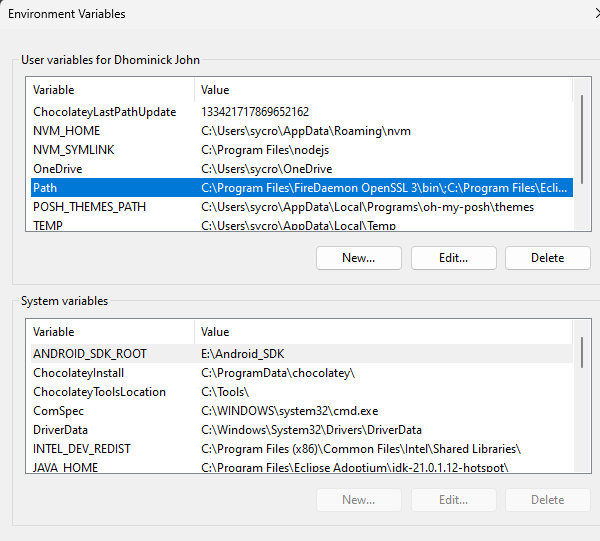
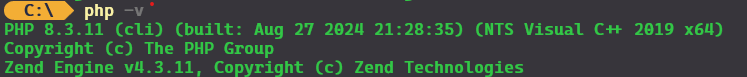

# Project Realtime Digital Point System Tracker
### By: WVSU - SPARK Hub and WVSU - Cipher 
### Project Team
1. Project Manager
    - Kirk Gamo
2. Project Supervisor
    - Keane Dalisay
3. UI/UX Designers
    - Mark Andrei Encanto
    - Joseph Junel Reyes
4. Front-end Developers
    - Allyn Ralf Ledesma
    - Quincy Macalalag
    - John Chrizper Escorpiso
    - Gabrielle Ann Concepcion
6. Back-end Developers
    - Rei Ebenezer Duhina
    - Dhominick John Billena
    - Christopher Glenn Bedis
#

### Based on operating system types: 

# Windows
### Installation of the needed dependencies
1. JavaScript Package Manager / Environment (Choose one!)
    - Bun : 
        > powershell -c "irm bun.sh/install.ps1|iex"
    - NodeJS : Node Package Manager - Fast Node Manager
        > `winget install Schniz.fnm` # installs (Fast Node Manager)

        > `fnm env --use-on-cd | Out-String | Invoke-Expression` # configure fnm environment

        > `fnm use --install-if-missing 22` # download and install Node.js

        > `node -v` # should print v22.9.0 # verifies the right Node.js version is in the environment
2. Vite
    - Node : 
    > `npm install vite@latest`
    - Bun  : 
    > `bun install vite@latest`

3. Node Version Manager (NVM) 
    > https://github.com/coreybutler/nvm-windows/releases 
        
> ## Important : 
    > A Node Package Manager is important as sooner the project might require some specific version of node for specific modules / packages, comparing the performances of the backend might require comparing version of node to run the backend on if you use `NodeJS`.

4. Powershell
    - Using a terminal shell will make the process working with the backend more smoothly as it is easier to follow through the commands needed for installing the packages.

5. Installing the modules 
    - Bun: 
        > bun install or bun i
    - Npm: 
        > npm install or npm i 

### Installing PHP
- Visit the PHP Webpage to Install latest Version of PHP
    > https://windows.php.net/downloads/releases/php-8.3.11-nts-Win32-vs16-x64.zip

    - Extract the ZIP folder on the folder of choice. Prefered using 'C:/php'

    - Add the PHP Environment variable by Searching `Environment Variables` on your Search Bar or on Control Panel 
> Note: NO Command Here cause I literally destroyed my PC path files creating a script to simplify this process, and yes I destroyed my environment variables using setx and will be reinstalling and yes also my registry! So, don't do it, thanks. :)

#### Figure 1: Environment Variables for PC 

- Open the Path Variable and copy the `C:/php/` and click on the New Button and Paste the Path. 
- Close all cmd windows / powershell windows
- Open a new command window
- Type 
    > php -v 
#

#### Figure 2: PHP Version

## Congrats you've succesfully set-up the project backend! 

# Mac

- To be made if needed :)

# Linux 

- Contact Us Directly: @DhominickJ @Christopher-Glenn @Reiebenezer 

- If you use Gentoo / Arch then, don't consult us. Talk to us, we are willing to learn more from you!

